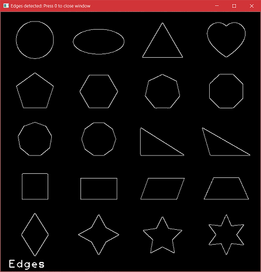

# Image-Operations
<h4>Created as part of course CS5100-Foundations of Artificial Intelligence at Northeastern University</h4>

Class Image with functions for displaying an image, rotating the image, smoothening the image (averaging blur, gaussian blur and median blur), converting RGB to grayscale, thresholding, edge detection (canny algorithm), contour detection and drawing on the image.

<h3>Results</h3>

<ol>
  <li>Original image</li> 
  

  <li>Rotated image</li> 
  

  <li>Smoothened image - Averaging blur, Gaussian blur and Median blur</li> 
  

  <li>Grayscale image</li> 
  

  <li>Thresholded image</li> 
  

  <li>Canny edge detection</li> 
  

  <li>Contour detection and drawing on original image</li> 
  

 </ol>
 
 
<h3>Files included</h3>

<ol>
<li>image-operations.py - Python code for the various operations on an image</li>
<li>Image files shapes.jpg / lotr.jpg - the images on which the operations are to be performed</li>
<li>Results folder - snapshots of the results of the operations
</ol>

  
